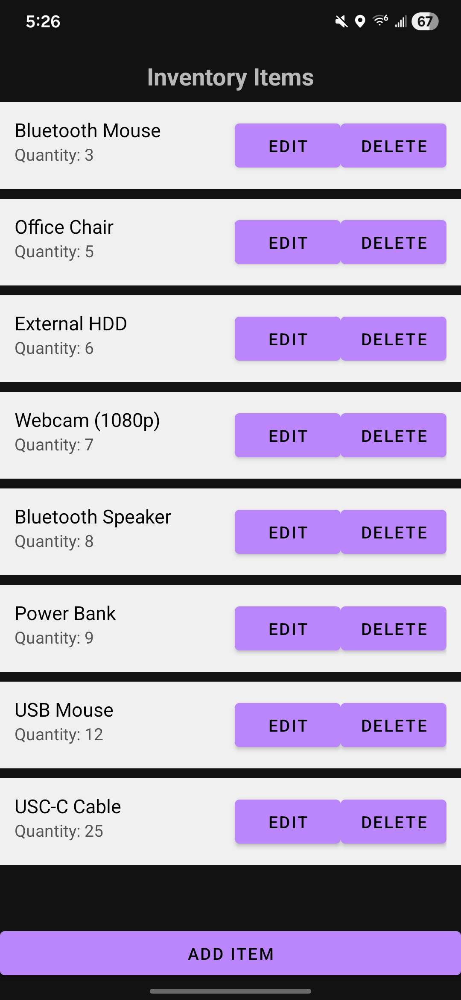

# Eli Maholik

This ePortfolio showcases my work throughout the Computer Science capstone, including my code review, software enhancements, and reflections on the program outcomes I have achieved.

# Professional Self-Assessment
Throughout my time in the Computer Science program at Southern New Hampshire University, I have developed a strong foundation in software development, problem solving, and professional communication. Completing my coursework and building my ePortfolio has allowed me to not only demonstrate my technical abilities, but also reflect on how those skills translate into real-world applications. As I prepare to enter the professional field, I feel confident in my ability to design, build, and improve software solutions.

One of the most valuable aspects of this program has been learning how to work in collaborative environments and communicate with different stakeholders. While assignments were completed individually, courses such as my capstone and full stack development projects required me to think from the perspective of clients and end users. For example, while planning and developing my capstone inventory application, I approached the project as if I were working with a real client by considering usability, feature prioritization, and scalability. Additionally, my current freelance project has further strengthened my ability to communicate professionally, define project scope, and break down complex requirements into manageable development phases. These experiences have helped my understand that successful software development is not just about writing code, but about clearly communicating ideas and building solutions that meet user needs.

My coursework also strengthened my understanding of data structures and algorithms, which are essential for building efficient and scalable applications. In my capstone project, I implemented search, sorting, and filtering functionality to improve the usability of my inventory application. Implementing these features required thoughtful consideration of performance and user experience, especially as data sets grow. Beyond the capstone, I gained experience analyzing algorithm efficiency and selecting appropriate data structures in earlier coursework, which has helped me approach problems more strategically and write optimized code. 

In terms of software engineering and database development, I have gained hands on experience designing full-stack applications. My capstone project began as a locally stored Android application use SQLite, but I later enhanced it by developing a back-end server using Node.js and Express with a connected SQLite database. This transition allowed me to implement a more scalable architecture and better simulate real-world application development. I also applied similar concepts in my full stack development coursework, where I worked with the MEAN stack to build a web application with a RESTful API and a single page application (SPA) front end. These experiences have strengthened my understanding of application architecture, separation of concerns, and the importance of maintainable and organized code. 

Security has been another important area of focus throughout my program. In my capstone enhancements, I implemented password hashing using bcrypt and token-based authentication using JSON Web Tokens (JWT) to protect user data. This experience reinforced the importance of building security into applications from the ground up rather than treating it as an afterthought. Additionally, coursework is software reverse engineering exposed me to common vulnerabilities and helped me understand how attackers can analyze compiled programs. This perspective has strengthened my ability to anticipate potential risks and design systems more securely. 

The artifact included in this ePortfolio collectively demonstrates my growth as a software developer and my ability to apply a wide range of technical skills. The code review provides insight into my ability to apply a wide range of technical skills. The code review provides insight into my ability to critically evaluate software and identify areas for improvement. My software design and engineering enhancements highlight my ability to refactor and improve application structure and user experience. The algorithms and data structures enhancements demonstrate my ability to implement efficient functionality that improves performance and usability. Finally, my database and back end enhancements showcase my ability to design and integrate scalable systems with secure user authentication.

Together, these artifacts represent not only my technical abilities, but also my problem solving mindset, attention to detail, and commitment to continuous improvement. This ePortfolio serves as a comprehensive reflection of my skills and experiences, and it demonstrates my readiness to contribute as a software developer in a professional environment. 

## Code Review
This code review examines my original Android inventory application, discusses its strengths and weaknesses, and outlines the enhancements I plan to make as part of my capstone project.

  <iframe width="560" height="315" 
    src="https://www.youtube.com/embed/GEidXgK3Bcw?si=IRsUoAneBKaIUTtK" 
    title="YouTube video player" 
    frameborder="0" 
    allow="accelerometer; autoplay; clipboard-write; encrypted-media; gyroscope; picture-in-picture; web-share" referrerpolicy="strict-origin-when-cross-origin"
    allowfullscreen>
  </iframe>

## Technical Enhancements
This section highlights the enhancements made to my Android inventory application as part of my capstone project. These improvements demonstrate my ability to refine software design, implement efficient algorithms, and develop scalable back-end systems. Together, these enhancements transformed the application from a locally stored system into a more robust, user-friendly, and production-ready solution.

[View Enhanced Code on GitHub](https://github.com/eli-maholik/inventory-application-system)

### Software Design & Engineering Enhancements
To improve the overall structure and usability of the application, I refactored key components of the codebase and enhanced the user interface. These changes focused on maintainability, readability, and user experience.

The original implementation contained large methods and repeated logic, particularly within activity classes. I addressed this by breaking down complex methods into smaller, reusable helper functions and consolidating duplicated dialog logic into a unified structure. This improved both code organization and scalability.

From a user interface perspective, I redesigned key elements of the application to create a more modern and intuitive experience. Enhancements included the use of Material Design components such as cards and floating action buttons, improved layout spacing, and clearer visual hierarchy. These changes made the application easier to navigate and more visually appealing.

The following screenshots illustrate the user interface before and after enhancements were implemented.

  
  

### Algorithms & Data Structures Enhancements
To improve data handling and usability, I implemented several features that rely on core algorithmic concepts, including searching, sorting, and filtering.

A real-time search feature was added to allow users to quickly locate inventory items by name. This required efficient string matching and dynamic updates to the displayed dataset. Additionally, sorting functionality was implemented to organize items based on attributes such as name and quantity, while filtering capabilities allow users to isolate specific subsets of data, such as low inventory items.

These enhancements significantly improved the user experience by reducing the need for manual navigation through large datasets. From a technical standpoint, they reinforced my understanding of how data structures such as lists interact with algorithms to support efficient data manipulation and retrieval.

The following screenshots showscase the implemented search and sorting enhancements.

  
  

### Database & Back-End Enhancements
To expand the scalability and realism of the application, I transitioned from a purely local database to a client-server architecture. The original application used SQLite for local data storage, which was effective for basic functionality but limited in terms of scalability and real-world applicability.

To address this, I developed a back-end server using Node.js and Express, connected to a SQLite database. This allowed the application to handle data more dynamically and simulate a production-like environment. I implemented RESTful API endpoints to manage user authentication and inventory data operations, enabling communication between the mobile application and the server.

Security was a major focus of this enhancement. I implemented password hashing using bcrypt and secured user authentication with JSON Web Tokens (JWT). These measures ensure that sensitive user data is protected and that only authorized users can access application resources.

This transition demonstrated my ability to design and integrate full-stack systems, as well as my understanding of database management, API development, and secure application design.

### Impact of Enhancements
Collectively, these enhancements transformed the application into a more scalable and efficient system. The improvements in software design increased maintainability and code quality, the implementation of algorithms enhanced performance and usability, and the integration of a back-end system introduced a more realistic and secure architecture. This work reflects my ability to approach software development holistically, considering not only functionality but also performance, scalability, and security.
