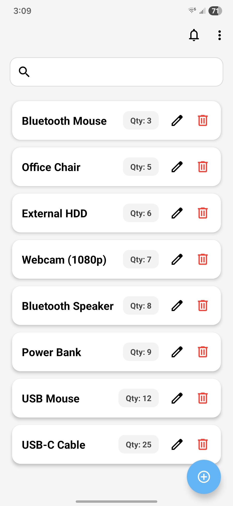
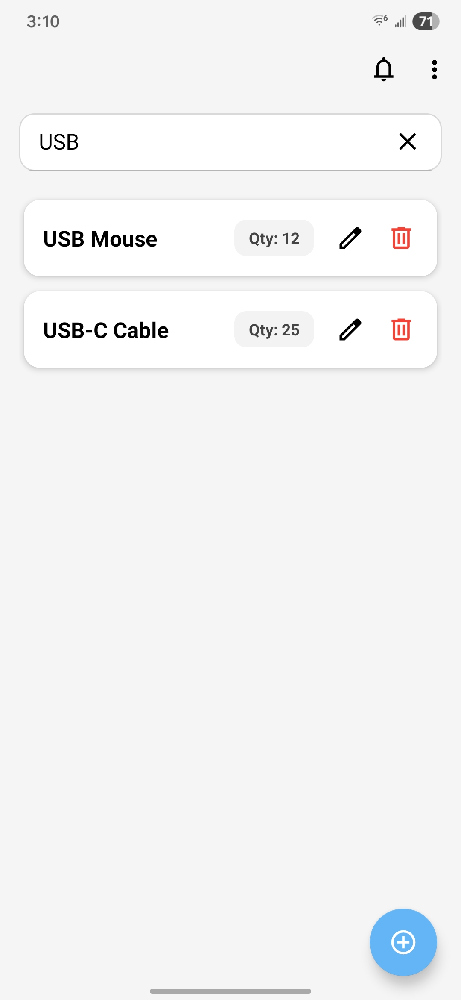
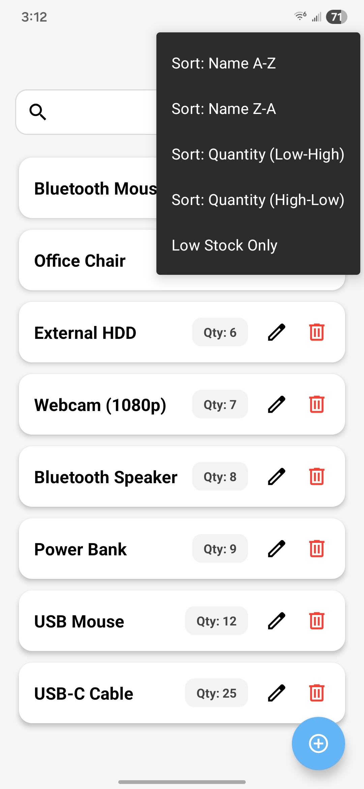

# Eli Maholik

This ePortfolio showcases my work throughout the Computer Science capstone, including my code review, software enhancements, and reflections on the program outcomes I have achieved.

## Code Review
This code review examines my original Android inventory application, discusses its strengths and weaknesses, and outlines the enhancements I plan to make as part of my capstone project.

  <iframe width="560" height="315" 
    src="https://www.youtube.com/embed/GEidXgK3Bcw?si=IRsUoAneBKaIUTtK" 
    title="YouTube video player" 
    frameborder="0" 
    allow="accelerometer; autoplay; clipboard-write; encrypted-media; gyroscope; picture-in-picture; web-share" referrerpolicy="strict-origin-when-cross-origin"
    allowfullscreen>
  </iframe>

## Software Design & Engineering Enhancements
This section highlights the enhancements I made to my Android inventory application to improve its structure, usability, and maintainability. These changes reflect my growth in software design principles and my ability to refactor existing code into a more scalable and user-friendly solution.

### Application Screenshots
Below are examples of the enhanced user interface and functionality of the application.

  
  
  

### Enhanced Application Code
[View Enhanced Code on GitHub](https://github.com/eli-maholik/inventory-application-system)

